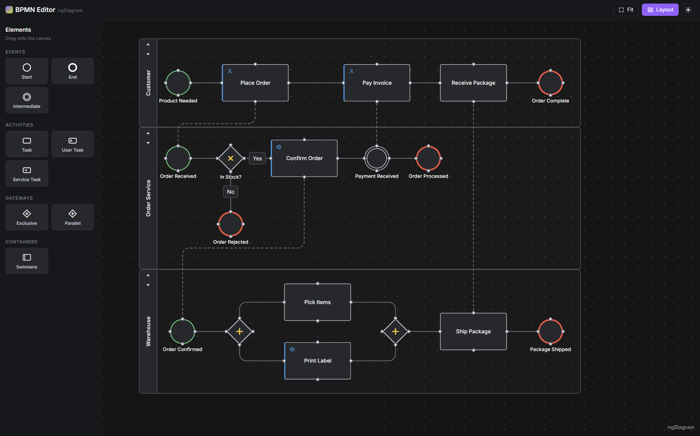

# ngDiagram BPMN Editor Template

[](https://opensource.org/licenses/MIT)

**Live demo:** [synergycodes.github.io/bpmn-editor](https://synergycodes.github.io/bpmn-editor/)



Interactive BPMN process editor built with Angular 19 and [ngDiagram](https://www.ngdiagram.dev/). Use this project as a starting point for building your own process editor. Lean dependencies: Angular, ngDiagram, and ELK.js — no opinionated third-party UI libraries.

> ### 📖 Read the tutorial
>
> This repository is the complete companion code for the step-by-step article **[How to build a BPMN editor in Angular with ngDiagram](https://dev.to/ngdiagram-dev/how-to-build-a-bpmn-editor-in-angular-with-ngdiagram-4id0)**. The article walks through the whole build and doubles as a hands-on ngDiagram tutorial — read it alongside this code to see how each piece comes together.

Features:

- 9 BPMN shapes: start / end / intermediate events, task / user / service activities, exclusive / parallel gateways, swimlanes
- 3 typed connection styles: sequence flow, message flow, association — every user-drawn edge becomes a typed sequence flow
- Swimlanes as ngDiagram groups: drop-zone highlighting, auto-parenting on drop, reorder buttons, shared width
- Live lane resize: while one lane is dragged, the others follow tick by tick — widths stay equal, the stack stays flush
- Per-lane auto-layout powered by [ELK.js](https://www.npmjs.com/package/elkjs) (never automatic — a toolbar button)
- Inline label editing everywhere: tasks, events, gateways, lane titles, and edge labels (double-click)
- Drag-and-drop palette driven by plain data
- Selection styling for nodes and edges, port hover affordance
- Dark/light theme from one `data-theme` attribute — app chrome and engine flip together

## Getting Started

Built against Angular 19.2 and ngDiagram 1.3 (see `package.json`); Node.js 18.19+, 20.11+ or 22 and npm 10+.

```bash
git clone https://github.com/synergycodes/bpmn-editor.git
cd bpmn-editor
npm install
npm start
```

Open [http://localhost:4200](http://localhost:4200) — a demo process across three swimlanes loads (18 elements, 20 flows). Try dragging a task from the palette into a lane, double-clicking it to rename it, then pressing **Layout** in the toolbar. The demo process is seed data — replace it in [`bpmn/diagram/bpmn-seed.ts`](src/app/bpmn/diagram/bpmn-seed.ts).

## Scripts

| Command | Description |
|---|---|
| `npm start` | Start dev server with hot reload |
| `npm run build` | Production build to `dist/` |
| `npm run format` | Format code with Prettier |

## ngDiagram APIs Demonstrated

This template exercises a broad slice of the ngDiagram public surface, useful as a reference for which APIs to reach for in your own integration.

| Concern | API | Where in this repo |
|---|---|---|
| Bootstrap | `provideNgDiagram()` | `bpmn/pages/editor-page.component.ts` |
| Diagram component | `<ng-diagram>` (`NgDiagramComponent`) | `bpmn/diagram/diagram.component.html` |
| Background | `<ng-diagram-background>` | `bpmn/diagram/diagram.component.html` |
| SVG arrowheads | `<ng-diagram-marker>` + `context-stroke` markers | `bpmn/diagram/diagram.component.html` |
| Custom node templates | `NgDiagramNodeTemplateMap`, `NgDiagramNodeTemplate<TData>` | `bpmn/diagram/diagram.component.ts`, `bpmn/diagram/templates/nodes/` |
| Group template (swimlane) | `NgDiagramGroupNodeTemplate`, `NgDiagramNodeResizeAdornmentComponent`, `ngDiagramGroupHighlighted` | `bpmn/diagram/templates/nodes/swimlane-node/` |
| Selection styling | `ngDiagramNodeSelected` directive; edge `.selected` class + `--edge-*` variables | `bpmn/diagram/templates/` |
| Custom edge template | `NgDiagramEdgeTemplateMap`, `NgDiagramEdgeTemplate<TData>`, `NgDiagramBaseEdgeComponent` | `bpmn/diagram/templates/edges/bpmn-edge.component.ts` |
| Edge labels | `NgDiagramBaseEdgeLabelComponent` (`positionOnEdge`) | `bpmn/diagram/templates/edges/bpmn-edge.component.html` |
| Connection ports | `<ng-diagram-port>` (`NgDiagramPortComponent`) | `bpmn/diagram/templates/nodes/` |
| Port hover styling | `ng-diagram-port-hoverable-over-node` host class | `bpmn/diagram/templates/nodes/bpmn-element-node.ts` |
| Palette | `<ng-diagram-palette-item>`, `<ng-diagram-palette-item-preview>`, `NgDiagramPaletteItem` | `bpmn/palette/` |
| Model init | `initializeModel()` | `bpmn/diagram/diagram.component.ts` |
| Model reads | `NgDiagramModelService` (`getModel().getNodes()` / `getEdges()` for committed reads, `getChildren`) | `bpmn/diagram/swimlanes/swimlane.service.ts` |
| Model writes | `NgDiagramModelService` (`updateNode`, `updateNodes`, `updateNodeData`, `updateEdgeData`) | `bpmn/diagram/swimlanes/`, `bpmn/diagram/templates/` |
| Node commands | `NgDiagramNodeService.resizeNode` (works on unselected groups since 1.3) | `bpmn/diagram/swimlanes/swimlane.service.ts` |
| Resize adornment sides | `<ng-diagram-node-resize-adornment>` `activeSides` input | `bpmn/diagram/templates/nodes/swimlane-node/` |
| Grouping | `NgDiagramGroupsService.addToGroup` | `bpmn/diagram/diagram.component.ts` |
| Editor rules | `NgDiagramConfig`: `edgeRouting.defaultRouting`, `resize.getMinNodeSize`, `resize.allowResizeBelowChildrenBounds`, `grouping.canGroup`, `linking.validateConnection`, `linking.finalEdgeDataBuilder` | `bpmn/diagram/diagram-config.ts` |
| Template-output events | `(paletteItemDropped)`, `(nodeResized)` | `bpmn/diagram/diagram.component.html` |
| Viewport actions | `NgDiagramViewportService.zoomToFit` | `bpmn/toolbar/toolbar.component.ts` |
| Readiness | `NgDiagramService.isInitialized` | `bpmn/toolbar/toolbar.component.ts` |
| Interactive node content | `data-no-drag` / `data-no-pan` attributes | inline label editors throughout `bpmn/diagram/templates/` |
| Engine theming | `--ngd-*` tokens keyed on `data-theme`; `--ngd-resize-*` and `--ngd-default-edge-label-*` overrides | `src/styles.scss`, `bpmn/diagram/templates/edges/bpmn-edge.component.scss` |

## Customizing for Your Project

### Data Model

The whole "which BPMN" decision lives in `src/app/bpmn/model/bpmn.model.ts`: node type strings grouped into shape families, edge kinds, typed data contracts, geometry constants, and the `isLayoutEdge` predicate that decides which edges participate in auto-layout.

To add a new element type: add a type string to `BpmnNodeType`, put it in its family array (`EVENT_TYPES` / `TASK_TYPES` / `GATEWAY_TYPES`), give it a size in `NODE_SIZE`, and add a palette entry. The family arrays drive the template map, so no component work is needed unless the shape needs a new visual family.

### Palette

Palette entries are plain data in `src/app/bpmn/model/palette-data.ts` — one object per tile, carrying the node the drop will create. Tile icons are `<symbol>`s in the app-wide sprite (`src/app/shared/icons/icon-sprite.component.html`), referenced by name through `<app-icon>`.

### Seed Data

Replace the demo process in `src/app/bpmn/diagram/bpmn-seed.ts`. The placement math and node/edge factories sit at the bottom of the file; the model itself is a short declarative list at the top.

### Theming

Theme is driven by the `data-theme` attribute on `<html>` (`"light"` or `"dark"`) and persisted in `localStorage` (`src/app/core/theme.service.ts`, applied at boot via `provideAppInitializer`).

Color tokens are defined in `src/tokens.css` in two tiers:

- **Primitives** (`--prim-*`) — raw color ramps, aligned with the ngDiagram design system (the purple accent is the engine's `acc1`).
- **Semantic** (`--c-*`) — per-theme aliases; components use only these.

ngDiagram's own `--ngd-*` tokens key on the same `data-theme` attribute, so both worlds flip together. App-level overrides of engine tokens (resize adornment colors) live in `src/styles.scss` under the "engine bridge" section.

### Layout Engine

Lane contents are laid out by [ELK.js](https://www.npmjs.com/package/elkjs) (`layered` algorithm, `RIGHT` direction). The integration is intentionally narrow:

- **`bpmn/diagram/layout/elk-layout.service.ts`** — single ELK call site: nodes + layout-valid edges in, `{ width, height, positions }` out.
- **`bpmn/diagram/swimlanes/lane-auto-layout.ts`** — pure function turning per-lane ELK results into model updates: uniform lane width, lanes stacked to fit content, children at global coordinates.
- **`bpmn/diagram/swimlanes/swimlane.service.ts`** — orchestration: gathers lanes and their children, runs ELK per lane, commits everything in one batched `updateNodes`.

To swap ELK for another engine, replace `elk-layout.service.ts` with anything of the shape `(children: Node[], edges: Edge[]) => Promise<LaneLayoutResult>` — the swimlane layer only needs sizes and relative positions back.

## Architecture

### Service Hierarchy

All diagram-scoped services are provided at the page component level (`EditorPageComponent`), not the application root — the ngDiagram services attach to the diagram's DOM subtree.

```
EditorPageComponent (providers)
  ├── provideNgDiagram()
  ├── ElkLayoutService
  └── SwimlaneService
```

### Key Patterns

- **Compute-then-apply lane geometry** — all swimlane math (stacking, width sync, min-size, ELK write-back) lives in pure functions under `bpmn/diagram/swimlanes/`; `SwimlaneService` reads the model, calls a helper, and writes one batched update. During a lane resize this runs on every gesture tick as a single write.
- **Committed-model reads** — `NgDiagramModelService.nodes()` is a signal fed through effect scheduling, so inside diagram event handlers it can be one commit behind. Reads that must be fresh go through `getModel().getNodes()` (`SwimlaneService.lanes()`).
- **Shared inline editing** — the edit state machine (double-click to enter, focus after render, save on Enter or an outside press, cancel on Escape) is one abstract directive (`bpmn/diagram/templates/inline-editable-label.ts`); node, lane, and edge templates plug in by implementing `saveLabel`.
- **One icon sprite** — every UI icon is a `<symbol>` in `shared/icons/icon-sprite.component.html`, rendered by `<app-icon name="…">`; templates carry no raw SVG markup.

## Project Structure

```
src/app/
├── core/theme.service.ts               # data-theme switching + persistence
├── shared/icons/                       # app icon sprite + <app-icon>
└── bpmn/
    ├── model/                          # BPMN types, palette data, geometry constants
    ├── pages/                          # routed editor shell (provideNgDiagram here)
    ├── toolbar/                        # Layout / Fit / theme toggle
    ├── palette/                        # drag-and-drop palette
    └── diagram/
        ├── diagram.component.*         # <ng-diagram> host, template maps, drop/resize handlers
        ├── diagram-config.ts           # editor rules (linking, grouping, resize)
        ├── bpmn-seed.ts                # demo process
        ├── layout/                     # ELK.js wrapper (per-lane layered layout)
        ├── swimlanes/                  # lane logic: facade service + pure helpers
        └── templates/
            ├── inline-editable-label.ts  # shared inline-edit directive
            ├── nodes/                    # event / task / gateway / swimlane templates
            └── edges/                    # BPMN edge template (3 line styles + label)
```

## Tech Stack

- **Angular 19** — standalone components, signals, OnPush change detection
- **ngDiagram** ([`ng-diagram`](https://www.npmjs.com/package/ng-diagram) on npm) — diagram rendering, viewport management, groups, selection
- **ELK.js** — layered auto-layout inside lanes
- **Prettier** — code formatting

## Known ngDiagram Issues

The template contains a workaround driven by a current library gap. Resolving it would let us simplify the template.

- **Group hosts mirror `resize.getMinNodeSize` as inline `min-width`/`min-height`.** For lanes that minimum is content-driven and would visually inflate the lane beyond its model size. *Workaround:* a global rule zeroes the inline minimum for lanes (`src/styles.scss`).

This has been reported to the ngDiagram team. The template works today and is fully usable as-is.

## ngDiagram Documentation

For comprehensive ngDiagram documentation, examples, and API reference, visit: **[ngdiagram.dev/docs](https://www.ngdiagram.dev/docs)**

## Support

- **Issues**: [GitHub Issues](https://github.com/synergycodes/bpmn-editor/issues)
- **ngDiagram Discussions**: [GitHub Discussions](https://github.com/synergycodes/ng-diagram/discussions), [Discord](https://discord.gg/FDMjRuarFb)
- **ngDiagram Documentation**: [ngdiagram.dev/docs](https://www.ngdiagram.dev/docs)

## License

MIT — see [LICENSE](LICENSE).

---

Built with ❤️ by the [Synergy Codes](https://www.synergycodes.com/) team
